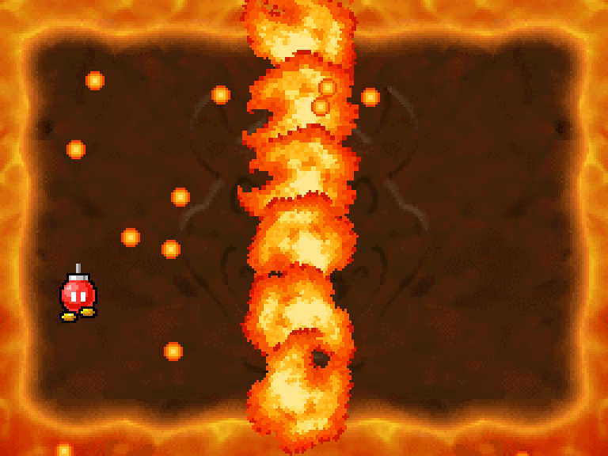
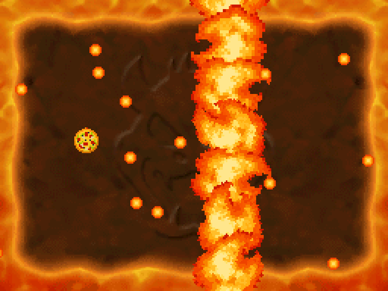

..

    Copyright 2019 RoadrunnerWMC

    This file is part of ndspy.

    ndspy is free software: you can redistribute it and/or modify

    it under the terms of the GNU General Public License as published by

    the Free Software Foundation, either version 3 of the License, or

    (at your option) any later version.

    ndspy is distributed in the hope that it will be useful,

    but WITHOUT ANY WARRANTY; without even the implied warranty of

    MERCHANTABILITY or FITNESS FOR A PARTICULAR PURPOSE.  See the

    GNU General Public License for more details.

    You should have received a copy of the GNU General Public License

    along with ndspy.  If not, see <https://www.gnu.org/licenses/>.

Tutorial 2: редактирование файла в архиве NARC

==============================================

.. py:currentmodule:: ndspy.narc
    :noindex:

Этот урок покажет, как открыть архив *NARC*, извлечь из него файл,

вставить обратно отредактированную версию и сохранить изменённый ROM.

Если вы уже прошли предыдущий урок (:doc:`rom-editing`), вам будет очень

понятно. *NARC* — это, по сути, мини-ROM без кода, только файлы и имена, поэтому

API для ROM и *NARC* очень похожи.

.. seealso::

    Если вы ещё не прошли первые два урока, рекомендую:

    *   :doc:`getting-started`: помогает убедиться, что ndspy установлен и настроен.

    *   :doc:`rom-editing`: написан в более медленном темпе и мягко вводит в работу

        с ndspy.

Открытие NARC

-------------

Начнём с импорта модуля :py:mod:`ndspy.narc`, предназначенного для архивов

*NARC*. Создайте файл ``narc_files_tutorial.py`` и вставьте:

.. code-block:: python

    :linenos:

    import ndspy.narc

Можете запустить, чтобы убедиться, что всё загружается. Но пока он ничего не делает.

Далее нужно открыть *NARC*. Класс :py:class:`NARC` принимает данные архива. Если

*NARC* лежит в ROM, можно сначала получить его через :py:mod:`ndspy.rom` и

передать в конструктор, например:

.. code-block:: python

    :emphasize-lines: 2, 4-6

    :linenos:

    import ndspy.narc

    import ndspy.rom

    rom = ndspy.rom.NintendoDSRom('nsmb.nds')

    narcData = rom.files[169]

    narc = ndspy.narc.NARC(narcData)

Для краткости я дальше буду считать, что ваш *NARC* — отдельный файл, и просто

использовать :py:func:`fromFile`:

.. code-block:: python

    :emphasize-lines: 3

    :linenos:

    import ndspy.narc

    narc = ndspy.narc.NARC.fromFile('vs_escape.narc')

Можете заменить на код с ROM, если хотите.

.. warning::

    Я использую переменную ``narc`` для объекта :py:class:`NARC`, потому что она

    представляет именно архив. Не путайте её с :py:mod:`ndspy.narc`, модулем,

    где определён класс!

    То же самое касается переменной ``rom`` и модуля :py:mod:`ndspy.rom` в

    некоторых местах.

Теперь у нас есть объект :py:class:`NARC`. Можно распечатать его, чтобы увидеть

все ID файлов, папки, имена и первые байты каждого файла:

.. code-block:: python

    :emphasize-lines: 4

    :linenos:

    import ndspy.narc

    narc = ndspy.narc.NARC.fromFile('vs_escape.narc')

    print(narc)

.. code-block:: text

    <narc endiannessOfBeginning='>'

        0000 vs_escape/

        0000     d_2d_mgvs_bg_escape_down_ncg.bin    b'\x10\0\x80\0?\0\0\xf0\1\xf0\x13\xf0%\xf07\xf0'...

        0001     d_2d_mgvs_bg_escape_down_ncl.bin    b'\x1f\03\tU\t:\1\x97\tz\5\x9b\5\xb9\r'...

        0002     d_2d_mgvs_bg_escape_down_nsc.bin    b'\x10\0\x08\0\0\x90\x82\x91\xe2\x92\x82\x93\x82\0\x94\xe2'...

        0003     d_2d_mgvs_bg_escape_up1_nsc.bin     b'\x10\0\x08\0\0\xc7\xa1\xc8\xa1\xc9\xb1\xca\x91\0\xcb\x81'...

        0004     d_2d_mgvs_bg_escape_up2_nsc.bin     b'\x10\0\x08\0 \x7f3\xf0\1\xfb5\xfa5\xf9\05'...

        0005     d_2d_mgvs_bg_escape_up3_nsc.bin     b'\x10\0\x08\00\x7f3\xf0\1p\1\x96\xd5\x96\xd1\xe0'...

        0006     d_2d_mgvs_bg_escape_up_ncg.bin      b'\x10\0\x80\0?\0\0\xf0\1\xf0\x13\xf0%\xf07\xf0'...

        0007     d_2d_mgvs_bg_escape_up_ncl.bin      b'\x94z\0\0\0\0\0\0\0\0\0\0\0\0\0\0\0'...

        0008     d_2d_mgvs_escape_ncg.bin            b'\x10\0@\06\0\0\xf0\1\x80\x130\xf0\x1fp1'...

        0009     d_2d_mgvs_escape_ncl.bin            b'\xa7}\0\0\xff\x7f\x18c\x10B\x08!\xff\3\xbc\2'...

    >

.. note::

    Не переживайте из-за ``endiannessOfBeginning`` — это значит, что ndspy

    обнаружил необычный заголовок и сохранит его при пересохранении.

    Если вы собираетесь создавать новый :py:class:`NARC` с таким заголовком,

    не забудьте выставить :py:attr:`NARC.endiannessOfBeginning` вручную.

Извлечение файла

-----------------

Я собираюсь извлечь файлы ``d_2d_mgvs_escape_ncg.bin`` и

``d_2d_mgvs_escape_ncl.bin`` — это графика и палитра мини-игры *Danger, Bob-omb!*.

    :scale: 30%

    :align: center

    Как выглядит мини-игра в обычном *New Super Mario Bros.* — на сенсорном

    экране двигаете бомбу и уворачиваетесь от колонн огня и огненных шаров.

.. note::

    Если вы ещё не в курсе связи между файлами, именами и ID в *NARC*,

    почитайте раздел :ref:`file-names-and-file-ids` во вводном материале модуля

    :py:mod:`ndspy.fnt` (используемого внутри :py:mod:`ndspy.narc`).

    Главное: файлы обращаются по ID, а ID — это индексы в списке всех файлов

    архива. Таблицы имён существуют отдельно и просто сопоставляют имена с ID.

    К слову, ID в *NARC* и в окружающем ROM (если такой есть) не связаны;

    даже если нумерация одинакова, это разные пространства.

Из вывода выше видно, что нужные файлы имеют ID 8 и 9, значит, можно взять

данные прямо по этим индексам:

.. code-block:: python

    :emphasize-lines: 5-6

    :linenos:

    import ndspy.narc

    narc = ndspy.narc.NARC.fromFile('vs_escape.narc')

    ncgData = narc.files[8]

    nclData = narc.files[9]

Или воспользоваться вспомогательным методом :py:class:`NARC`, который по имени

ищет ID и возвращает данные:

.. code-block:: python

    :emphasize-lines: 5-6

    :linenos:

    import ndspy.narc

    narc = ndspy.narc.NARC.fromFile('vs_escape.narc')

    ncgData = narc.getFileByName('vs_escape/d_2d_mgvs_escape_ncg.bin')

    nclData = narc.getFileByName('vs_escape/d_2d_mgvs_escape_ncl.bin')

Так или иначе, теперь у нас есть :py:class:`bytes` с данными нужных файлов.

Дальше можно редактировать: если ndspy поддерживает формат, импортируйте

соответствующий модуль и меняйте содержимое. (В данном случае файлы *NCL*

и *NCG* правятся через :py:mod:`ndspy.lz10` и :py:mod:`ndspy.graphics2D`, именно

так я сделал.) Если вы хотите отредактировать их внешним инструментом, можно

сохранить их наружу:

.. code-block:: python

    :emphasize-lines: 8-11

    :linenos:

    import ndspy.narc

    narc = ndspy.narc.NARC.fromFile('vs_escape.narc')

    ncgData = narc.getFileByName('vs_escape/d_2d_mgvs_escape_ncg.bin')

    nclData = narc.getFileByName('vs_escape/d_2d_mgvs_escape_ncl.bin')

    with open('d_2d_mgvs_escape_ncg.bin', 'wb') as f:

        f.write(ncgData)

    with open('d_2d_mgvs_escape_ncl.bin', 'wb') as f:

        f.write(nclData)

Замена файла

------------

Когда редактирование закончено, можно вставить файл обратно в архив.

Если вы меняли :py:class:`bytes` через другие модули ndspy, то данные уже

есть в памяти. Если вы сохраняли их вне ndspy, то надо прочитать:

.. code-block:: python

    :emphasize-lines: 5-8

    :linenos:

    import ndspy.narc

    narc = ndspy.narc.NARC.fromFile('vs_escape.narc')

    with open('d_2d_mgvs_escape_ncg_edited.bin', 'rb') as f:

        ncgData = f.read()

    with open('d_2d_mgvs_escape_ncl_edited.bin', 'rb') as f:

        nclData = f.read()

Теперь можно положить данные обратно, например, по ID:

.. code-block:: python

    :emphasize-lines: 10-11

    :linenos:

    import ndspy.narc

    narc = ndspy.narc.NARC.fromFile('vs_escape.narc')

    with open('d_2d_mgvs_escape_ncg_edited.bin', 'rb') as f:

        ncgData = f.read()

    with open('d_2d_mgvs_escape_ncl_edited.bin', 'rb') as f:

        nclData = f.read()

    narc.files[8] = ncgData

    narc.files[9] = nclData

Или по имени:

.. code-block:: python

    :emphasize-lines: 10-11

    :linenos:

    import ndspy.narc

    narc = ndspy.narc.NARC.fromFile('vs_escape.narc')

    with open('d_2d_mgvs_escape_ncg_edited.bin', 'rb') as f:

        ncgData = f.read()

    with open('d_2d_mgvs_escape_ncl_edited.bin', 'rb') as f:

        nclData = f.read()

    narc.setFileByName('vs_escape/d_2d_mgvs_escape_ncg.bin', ncgData)

    narc.setFileByName('vs_escape/d_2d_mgvs_escape_ncl.bin', nclData)

Сохранение NARC

---------------

Остаётся сохранить сам *NARC*. Если вы хотите вставить его обратно в ROM,

вызовите ``.save()`` и используйте результат для списка ``.files``:

.. code-block:: python

    :emphasize-lines: 2, 4, 16

    :linenos:

    import ndspy.narc

    import ndspy.rom

    rom = ndspy.rom.NintendoDSRom('nsmb.nds')

    narc = ndspy.narc.NARC.fromFile('vs_escape.narc')

    with open('d_2d_mgvs_escape_ncg_edited.bin', 'rb') as f:

        ncgData = f.read()

    with open('d_2d_mgvs_escape_ncl_edited.bin', 'rb') as f:

        nclData = f.read()

    narc.setFileByName('vs_escape/d_2d_mgvs_escape_ncg.bin', ncgData)

    narc.setFileByName('vs_escape/d_2d_mgvs_escape_ncl.bin', nclData)

    rom.files[169] = narc.save()

(Не забудьте потом сохранить и сам ROM!)

Если же вы хотите сохранить архив как отдельный файл, пользуйтесь

``.saveToFile()``:

.. code-block:: python

    :emphasize-lines: 13

    :linenos:

    import ndspy.narc

    narc = ndspy.narc.NARC.fromFile('vs_escape.narc')

    with open('d_2d_mgvs_escape_ncg_edited.bin', 'rb') as f:

        ncgData = f.read()

    with open('d_2d_mgvs_escape_ncl_edited.bin', 'rb') as f:

        nclData = f.read()

    narc.setFileByName('vs_escape/d_2d_mgvs_escape_ncg.bin', ncgData)

    narc.setFileByName('vs_escape/d_2d_mgvs_escape_ncl.bin', nclData)

    narc.saveToFile('vs_escape_edited.narc')

Вот и всё! Наслаждайтесь изменённым архивом.

    :scale: 30%

    :align: center

    Это должна быть пицца, но я рисую плохо. Зато попытался!
